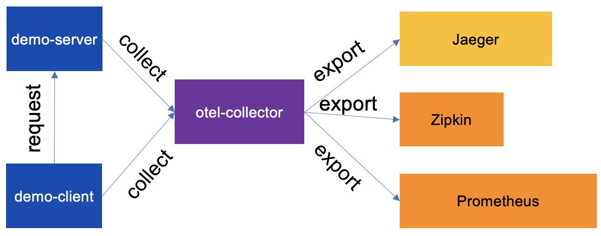

# OpenTelemetry Collector Demo


- The client and server send data directly to the OTel Collector;

This demo uses `docker-compose` and by default runs against the
`otel/opentelemetry-collector:0.67.0` image. To run the demo, switch
to the `examples/demo` folder and run:

```shell
docker-compose up -d
```

The demo exposes the following backends:

- Jaeger at http://0.0.0.0:16686
- Zipkin at http://0.0.0.0:9411
- Prometheus at http://0.0.0.0:9090

Notes:

- It may take some time for the application metrics to appear on the Prometheus
 dashboard;

To clean up any docker container from the demo run `docker-compose down` from
the `examples/demo` folder.

### Using a Locally Built Image
Developers interested in running a local build of the Collector need to build a
docker image using the command below:

```shell
make docker-otelcontribcol
```

And set an environment variable `OTELCOL_IMG` to `otelcontribcol` before
launching the command `docker-compose up -d`.
