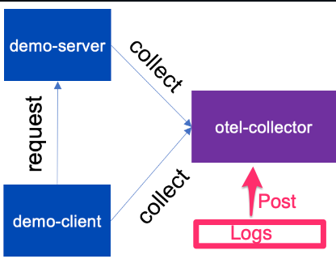

# OpenTelemetry Collector Demo


- Add JSON data to send to collector, into main.py in loggen. 
- The client and server send data to configured OTEL_EXPORTER_OTLP_ENDPOINT

This demo uses `docker-compose` 

```shell
docker-compose up -d
```

